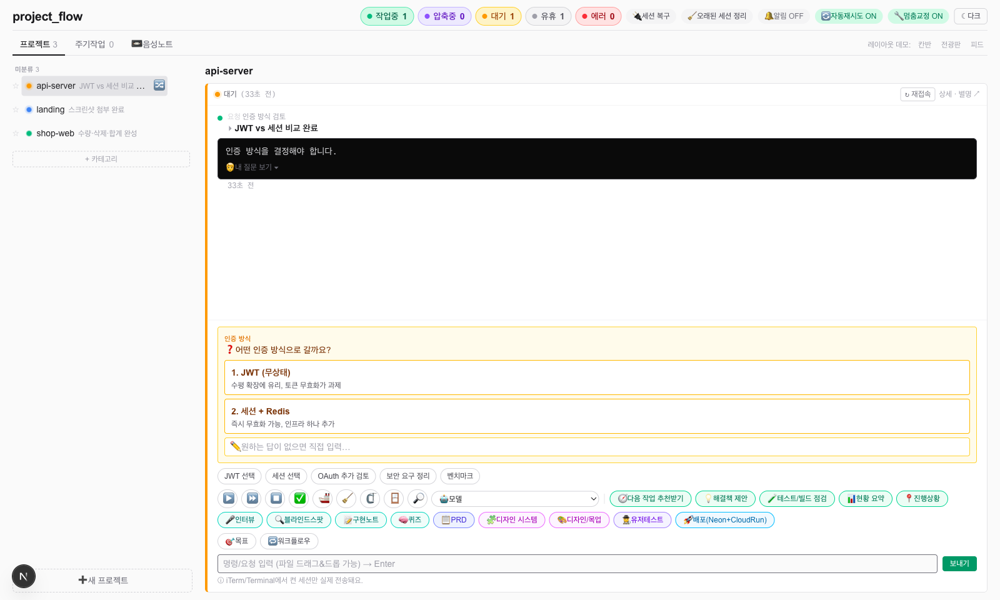
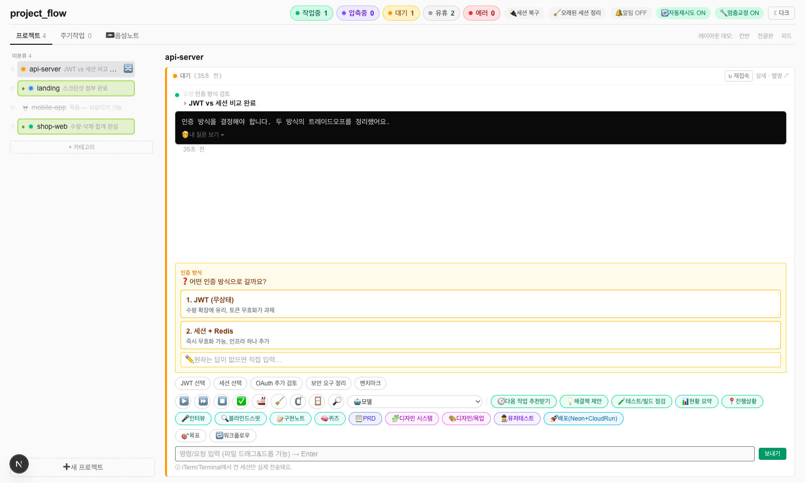
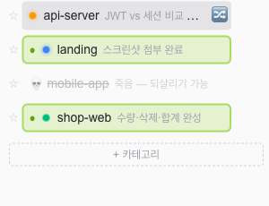
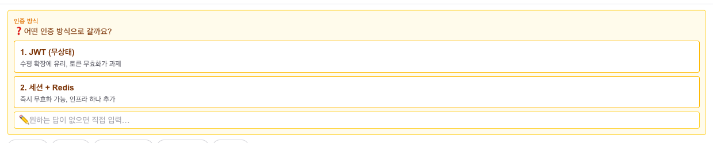
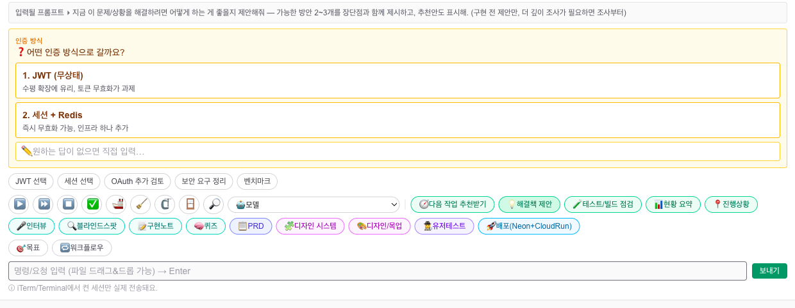
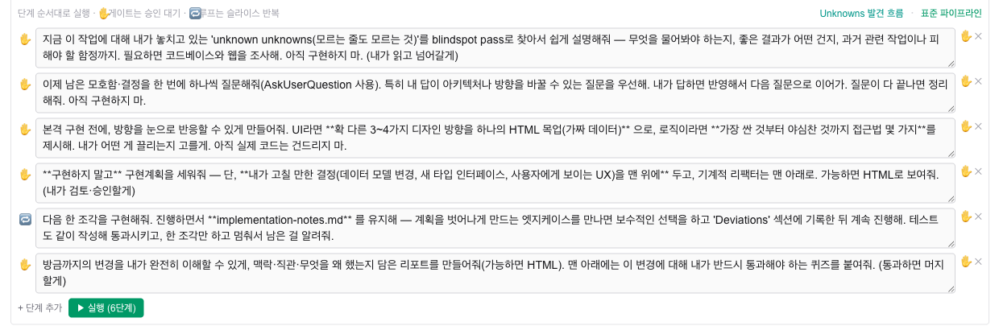
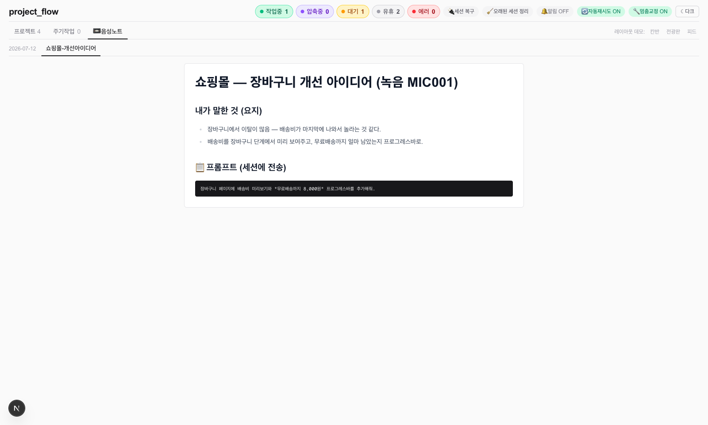

# pflow — Stop babysitting your AI. Run a fleet.

**English** | [한국어](README.ko.md) | [日本語](README.ja.md) | [中文](README.zh-CN.md)

One Claude Code session makes you faster. Ten make you a **babysitter** — hopping between terminal tabs, missing the one session that's been waiting on a question for 20 minutes, losing track of what any of them just did.

**pflow turns that chaos into a control tower.** Every session on one board, live. See what each one just did, answer its questions with one click, fire off prompts, run approval-gated workflows, and revive dead sessions after a reboot — without ever touching a terminal tab.



```bash
curl -fsSL https://raw.githubusercontent.com/skycream/pflow/main/install.sh | bash
```

*One command: checks & auto-installs iTerm2 and Node, clones, installs, registers auto-start, opens the board.*

## Features

- **Live mission control** — Real-time status of every session (working / waiting / idle / error / compacting) via SSE. Each turn auto-reports a one-line `[flow]` summary plus 5 next-step options
- **One-click answers** — Answer Claude's multiple-choice questions (AskUserQuestion) from the dashboard, including multi-question forms and free-text answers. Unread replies glow until you look
- **Quick actions** — ▶️ continue · ⏩ proceed-all · ⏹️ interrupt · ✅ approve · 🚢 ship · 🧹 /clear · 🗜️ /compact · 🤖 switch model — injected straight into the right iTerm session (hover any button to preview the exact prompt it sends)
- **Gated workflows** — Run spec → design → plan → vertical-slice implementation → verify → deploy with approval gates. Includes an "Unknowns discovery" preset (blindspot pass → interview → prototypes → plan → implementation notes → quiz)
- **Session lifecycle** — Dead sessions get a 💀 marker and one-click revive (`claude --resume`), bulk restore after reboot, in-place reconnect (reloads new skills), old-session cleanup to reclaim memory, and automatic stuck-turn correction
- **Voice notes** — Browse transcribed voice memos organized by topic (`data/voice-notes/`)
- **Auto-retry** — Transient errors (rate limits) retry automatically. OS notifications + tab badge when a session needs you

## Feature tour

### 🗼 One board, every session

Every project and session in the left rail with live status dots (working / waiting / idle / error). Header chips give you the fleet count at a glance. The selected session's full activity — request, answer, question — on the right. **You never wonder "what is session #7 doing?" again.**

### 🚦 The rail tells you where you're needed

Unanswered replies **glow green** until you read them. 🔀 marks a session waiting on a multiple-choice decision. Dead sessions show 💀 (struck through) instead of silently disappearing — nothing gets forgotten.

### ❓ Answer Claude's questions without touching the terminal

When Claude asks a multiple-choice question (AskUserQuestion), the options appear as buttons — with full descriptions. Click to answer. Multi-question forms are supported, and if none of the options fit, **type a free-text answer right there**.

### ⚡ One-click actions — with full prompt transparency

Continue, proceed-all, interrupt, approve, ship, /clear, /compact, model switch, PRD, design system, user test, deploy… **Hover any button and see the exact prompt it will inject** (the "입력될 프롬프트 ▸" bar) — no hidden magic.

### 🔁 Gated workflows — autopilot with checkpoints

Chain steps that run one after another; ✋ gates pause for your approval, 🔁 loops repeat per slice. The built-in **Unknowns discovery** preset (blindspot pass → interview → prototypes → plan → implementation notes → quiz) turns Fable-era best practices into one button.

### 💀 Sessions die. Conversations don't.

Killed a terminal? Rebooted? Dead sessions keep their place with a 💀 marker. One click (or just sending a message) revives the conversation with `claude --resume` — full context intact. Bulk-restore brings back your whole fleet after a reboot.

### 📼 Voice notes, organized

Drop transcribed voice memos into `data/voice-notes/` and browse them as tabs — with ready-to-send prompts extracted from your rambling.

## Requirements

- **macOS** + **iTerm2** (prompts are injected via AppleScript)
- **Claude Code** CLI
- Node.js 20+

## Install

**One-liner (recommended):**

```bash
curl -fsSL https://raw.githubusercontent.com/skycream/pflow/main/install.sh | bash
```

This checks (and auto-installs) iTerm2 and Node 20+, clones to `~/pflow`, installs dependencies, registers a LaunchAgent (starts on boot, auto-restarts if it dies), and opens the dashboard.

<details>
<summary>Manual install</summary>

```bash
git clone https://github.com/skycream/pflow
cd pflow
npm install
npm run dev   # http://localhost:3000
```

</details>

### 1) Install the plugin (event collection)

In Claude Code, add this repo as a marketplace and install the plugin:

```
/plugin marketplace add /path/to/pflow
/plugin install project-flow@flow-market
```

The plugin's hooks send each session's events (SessionStart / Stop / tool use / …) to `localhost:3000/api/hook`.

> To wire up just one project without the plugin, paste the hooks block from `examples/claude-settings.sample.json` into that project's `.claude/settings.json`.

### 2) Start sessions

Open any project folder in iTerm2 and run `claude` — the project and session appear in the dashboard's left rail automatically.

### 3) (Optional) Start on boot

Register a LaunchAgent to keep the dashboard always running (auto-restarts if it dies):

```xml
<!-- ~/Library/LaunchAgents/com.projectflow.dashboard.plist -->
<?xml version="1.0" encoding="UTF-8"?>
<!DOCTYPE plist PUBLIC "-//Apple//DTD PLIST 1.0//EN" "http://www.apple.com/DTDs/PropertyList-1.0.dtd">
<plist version="1.0"><dict>
  <key>Label</key><string>com.projectflow.dashboard</string>
  <key>RunAtLoad</key><true/>
  <key>KeepAlive</key><true/>
  <key>WorkingDirectory</key><string>/path/to/pflow</string>
  <key>ProgramArguments</key><array>
    <string>/opt/homebrew/bin/npm</string><string>run</string><string>dev</string>
  </array>
</dict></plist>
```

```bash
launchctl bootstrap gui/$(id -u) ~/Library/LaunchAgents/com.projectflow.dashboard.plist
```

## How it works

```
┌──────────────┐  hooks (HTTP)  ┌───────────────────┐   SSE    ┌───────────┐
│ Claude Code   │ ─────────────▶ │  Next.js server    │ ───────▶ │ Dashboard  │
│ sessions      │                │  + SQLite(flow.db) │          │ (browser)  │
└──────────────┘ ◀───────────── └───────────────────┘          └───────────┘
              AppleScript injection      ▲ transcript (JSONL) parsing
```

- Each session's **hooks** post events to the dashboard server → state recorded in SQLite → pushed to the browser via **SSE**
- A **UserPromptSubmit hook** instructs Claude to end every turn with `[flow] request → result` / `[flow-next] 5 options`, which are parsed from the transcript (JSONL) and shown on the board
- Answers/prompts you send from the dashboard are typed into the target iTerm session via **AppleScript**

## Data & privacy

Everything stays on your machine (`data/` — gitignored). Nothing is sent anywhere.

## License

MIT
